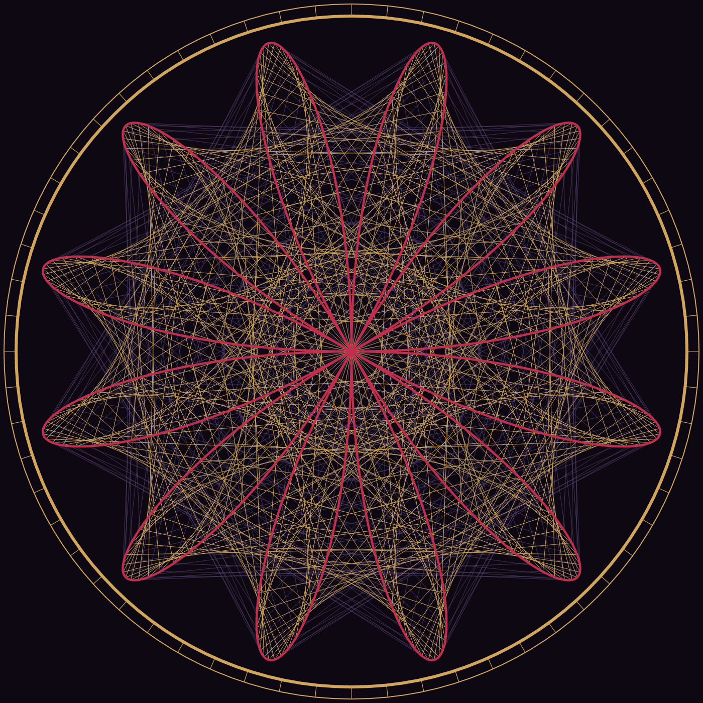
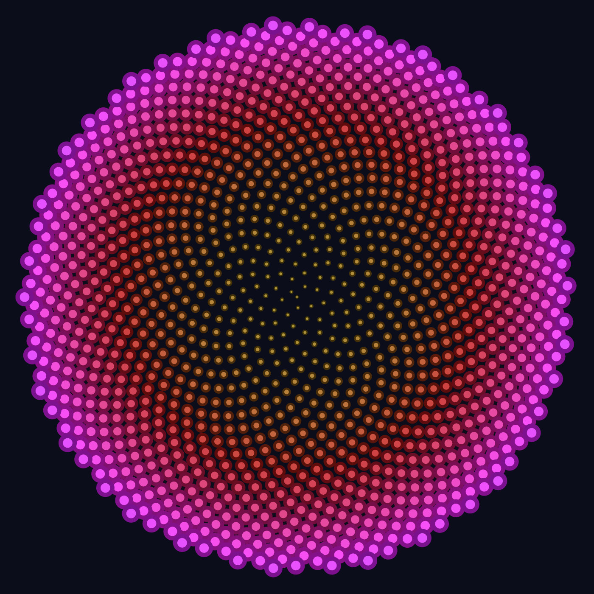
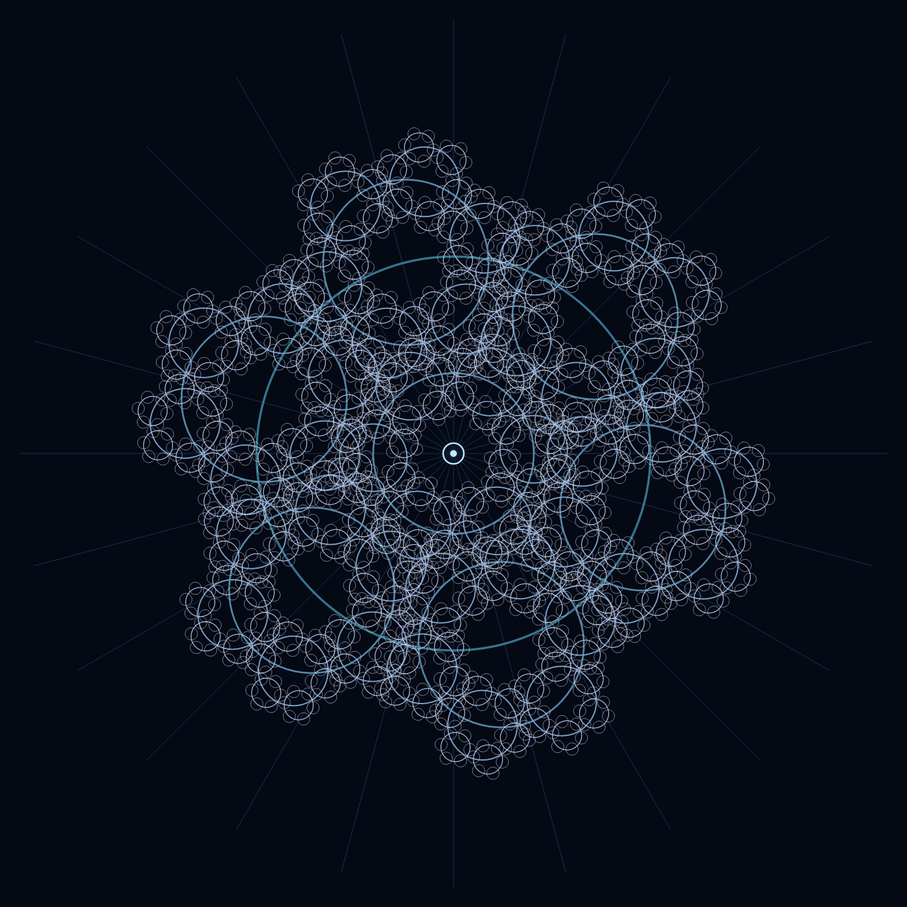
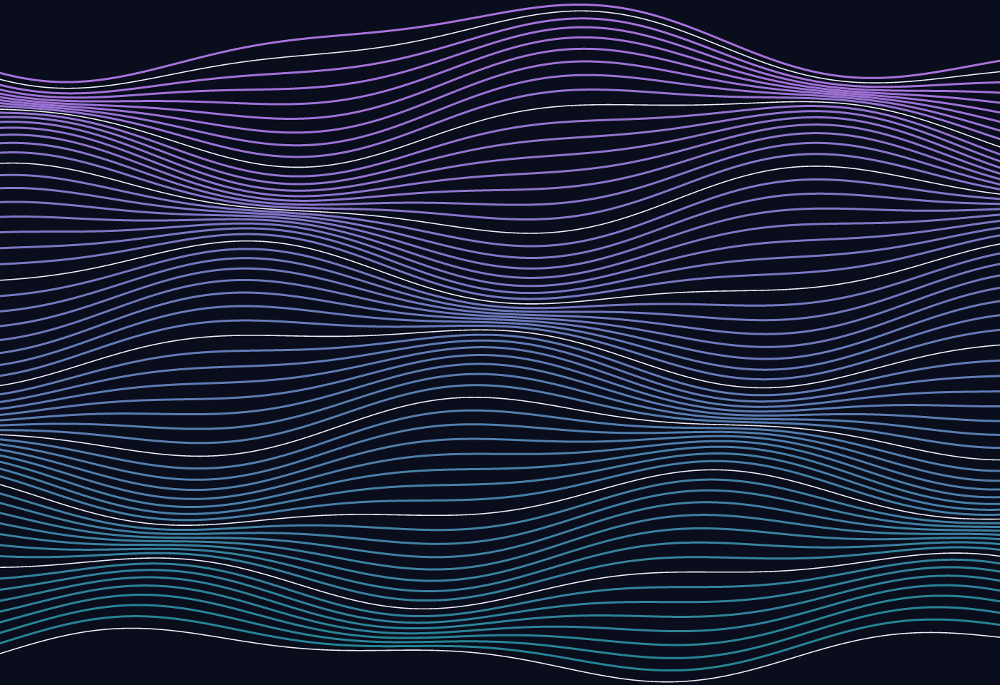
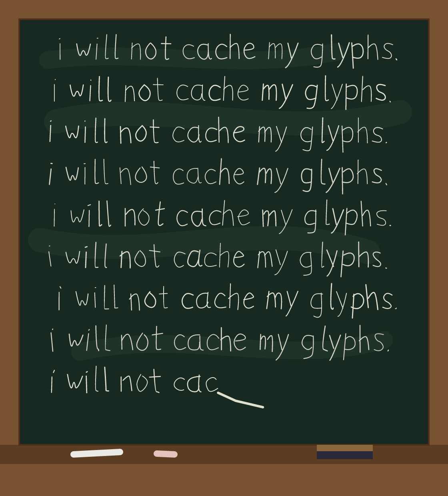

# pscat

A PostScript interpreter, written in Rust, for watching PostScript programs
draw live — built for personal fun rather than as a Ghostscript
replacement, though it's meant to grow toward broad spec coverage over
time.

## Status

**Stage 6 (text and fonts) and Stage 7 (files, filters, images) are
complete.** Text works in three font technologies:

- **The standard base fonts** (Helvetica, Times, Courier families,
  backed by bundled metric-compatible Liberation faces) through the
  full operator set: `findfont`/`scalefont`/`makefont`/`setfont`/
  `selectfont`/`definefont`, `show`/`ashow`/`widthshow`/`awidthshow`/
  `kshow`, `stringwidth`, `charpath` (text as geometry), Standard and
  ISOLatin1 encodings with the PLRM re-encoding idiom.
- **Type 3 fonts** — glyphs that are programs: `BuildChar`/`BuildGlyph`
  run on the machine in sealed glyph contexts (see
  `examples/type3_ransom.ps`, where every glyph is invented fresh at
  show time), including bitmap fonts that stamp their raster with
  `imagemask`.
- **Type 1 fonts** — the real thing: `currentfile eexec`, encrypted
  charstrings via the `N RD <binary>` idiom, a hint-ignoring
  charstring interpreter with flex and seac. The test suite generates
  a complete PFA and Ghostscript accepts the identical bytes.

And the Stage 7 machinery underneath: **file objects** sharing one
read cursor with the scanner (`currentfile`, `read*`, `token`/`exec`
on files), **decode filters** (ASCIIHex, ASCII85, RunLength, Flate,
LZW, DCT/JPEG) as composable on-demand file layers, and **sampled
images** — `image`/`imagemask`/`colorimage` in both operand forms,
from string, file, filter-chain, or procedure data sources, through
the full CTM/clip pipeline. `examples/postcard.ps` shows it all
inline; `FONTS.md` has the font design writeup, `HANDOFF.md` the
state of the world and what's next (Stage 8: name interning).

**Stage 8 (VM fidelity) complete**: full `save`/`restore` semantics
(`VM.md` is the design writeup, pinned against Ghostscript), interned
names (fib 27 ~1.6× faster), Indexed/Separation color spaces, Level 2
odds and ends, and a found-file corpus — tiger.eps and the other gs
classics render block-identical to Ghostscript.

**Stage 9 (output targets) complete**: real multi-page `showpage`
(the window keeps showing the finished page; `--png` numbers pages),
`--dpi` for print-resolution rendering, and `--svg`/`--pdf` export —
both mirror the paint pipeline directly, and the PDF is verified by
letting Ghostscript rasterize it back.

**Stage 11 (performance parity)**: `cargo bench --bench vs_gs` races
both interpreters on speed and peak memory. pscat starts 5× faster,
uses 3–5× less memory on every workload, and wins every rendering
page; the honest remaining gaps (fib ~2.3×, fern ~1.9×) and what was
done about them live in NOTES.md.

**Stage 12 (handwriting)**: `examples/handwriting.ps` — a Type 3
font whose glyphs are generated fresh per draw with rand-jittered
strokes, wandering baselines, and varying pen pressure. No two
letters ever match, every page is reproducible, and the same file
runs in Ghostscript.

**Stage 10 (the LaserWriter experience) complete**: `--spool DIR`
turns the window into the printer in the corner of the lab — it
idles, watches a directory, and renders each `.ps`/`.eps` that lands
there, page by page, each job in a fresh interpreter. `--halftone`
screens the raster like a mono laser printer's RIP: classic
euclidean dots on a 45° lattice, coverage tracking darkness, for the
window and `--png`. Gallery II opened with *Hundred Lines*, the
Stage 12 handwriting font writing punishment lines on a chalkboard.

**Stage 5 (run found PostScript) complete.** Beyond drawing live, pscat
now executes the idioms real-world `.ps` files depend on: arrays and
strings with true PLRM view semantics (`get`/`put`/`getinterval`/
`forall`/`aload`), dictionaries with arbitrary keys and `<<>>` literals,
type conversions (`cvi`/`cvs`/`cvx`/…), catchable errors
(`stopped`/`stop`/`$error`), `search`/`token`, clipping, dash patterns,
HSB/CMYK color, the full matrix operator set, `//immediate` names, and
ASCII85 strings. `examples/testcard.ps` — written like a found file,
shortcut prolog and all — renders identically in pscat and Ghostscript.

All of Stage 1–4 still holds: the language core (tokenizer,
object model, three-stack interpreter, stack/arithmetic operators, `def`,
dictionaries, `if`/`ifelse`, `for`/`repeat`/`loop`/`exit`, comparisons,
`bind`), the graphics engine (paths, `arc`/`arcn`, `fill`/`eofill`/
`stroke`, `gsave`/`grestore`, colors and line attributes,
`translate`/`rotate`/`scale`), and a **live window** so you can watch
programs draw — or headless PNG rendering, which is cross-checked against
Ghostscript on the example fractals. Errors use the standard PostScript
error names and never panic on program input (fuzz-tested); runaway
recursion is a catchable `execstackoverflow`, and tail-recursive
programs run in constant execution-stack space. The test suite includes
golden-image comparisons against Ghostscript. The REPL accepts
multi-line procedure definitions. See `NOTES.md` for the full
implemented-vs-not inventory and the Stage 5 recommendation.

Try `cargo run -- --page 500x500 examples/sierpinski.ps` and watch the
triangles appear.

See `INIT.md` for the project vision, `ARCHITECTURE.md` for the design
writeup, `NOTES.md` for per-stage summaries, and `ROADMAP.md` for the
staged plan of everything still to come (fonts, images, save/restore,
PDF export — with per-task model routing).

## Building & running

Requires a stable Rust toolchain.

```sh
cargo run -- --page 500x500 examples/sierpinski.ps      # watch it draw, live
cargo run -- --speed 10 file.ps           # slower (steps per frame, default 100)
cargo run -- --png out.png file.ps        # headless render to PNG
cargo run -- --page 500x500 file.ps       # canvas size (default 612x792)
cargo run -- --spool jobs/                # act like a lab printer: render
                                          # each .ps/.eps dropped into jobs/
cargo run -- --halftone file.ps           # classic 45° halftone dots, like a
                                          # mono laser printer (window/PNG)
cargo run                                 # interactive REPL
cargo run -- -e '3 4 add ='               # evaluate a snippet
cargo test                                # language + pixel-level render tests
```

The `examples/` directory has three recursive fractals (Sierpinski
triangle, Koch snowflake, golden spiral), a found-file-style test card,
and a type specimen (`specimen.ps`); all render identically in pscat
and Ghostscript.

## Gallery

`gallery/` holds generative-art programs written in pure PostScript for
this interpreter, each *within the operator set it had at the time*.
The six Stage 3 originals predate `rand`, `sethsbcolor`, and arrays, so
they carry their own linear-congruential random generator and HSB→RGB
converter as PostScript procedures; Ring of Type is built on Stage 6's
fonts. Everything is deterministic; change a `/seed` and a different
tree or fern grows.

| Piece | Technique |
|---|---|
| `golden_bloom.ps` | Phyllotaxis — 1,300 florets at the golden angle, √-spaced like a sunflower |
| `cathedral_rose.ps` | Maurer rose — straight chords walking r = sin 6θ in 71° / 97° strides weave lace |
| `ember_tree.ps` | Recursive branching from an LCG, banded dusk gradient, layered sun glow |
| `fern.ps` | Barnsley chaos game — 48,000 points over four affine maps, no outline drawn |
| `silk_waves.ps` | 66 threads displaced by two interfering sine fields |
| `frost_mandala.ps` | Six-fold circle recursion, 11° twist per generation — 1,555+ circles |
| `ring_of_type.ps` | (Stage 6) one sentence circling eleven shrinking rings, set glyph by glyph around a charpath ampersand |
| `hundred_lines.ps` | (Stage 10) the Stage 12 /HandScript dynamic font writing punishment lines on a chalkboard — same sentence nine times, no two letters alike |

View them one at a time:

```sh
./gallery/show.sh          # step through the rendered PNGs
./gallery/show.sh --live   # watch each piece draw itself in a window
```

<p>
  
  
  
</p>
<p>
  
  
  
</p>
<p>
  
</p>

Details, page sizes, and re-render instructions live in
`gallery/README.md`.

A REPL taste:

```
PS> 40 2 add =
42
PS> mark 1 2 3
PS<4> pstack
3
2
1
-mark-
```

Sample programs for the upcoming graphics stages live in `examples/`.

## Why

I used to write raw PostScript by hand in college and send it straight to
a LaserWriter. This is a from-scratch Rust interpreter built to relive
that — watching a hand-written recursive PostScript program draw itself,
live, without depending on a decades-old C codebase to do it.
