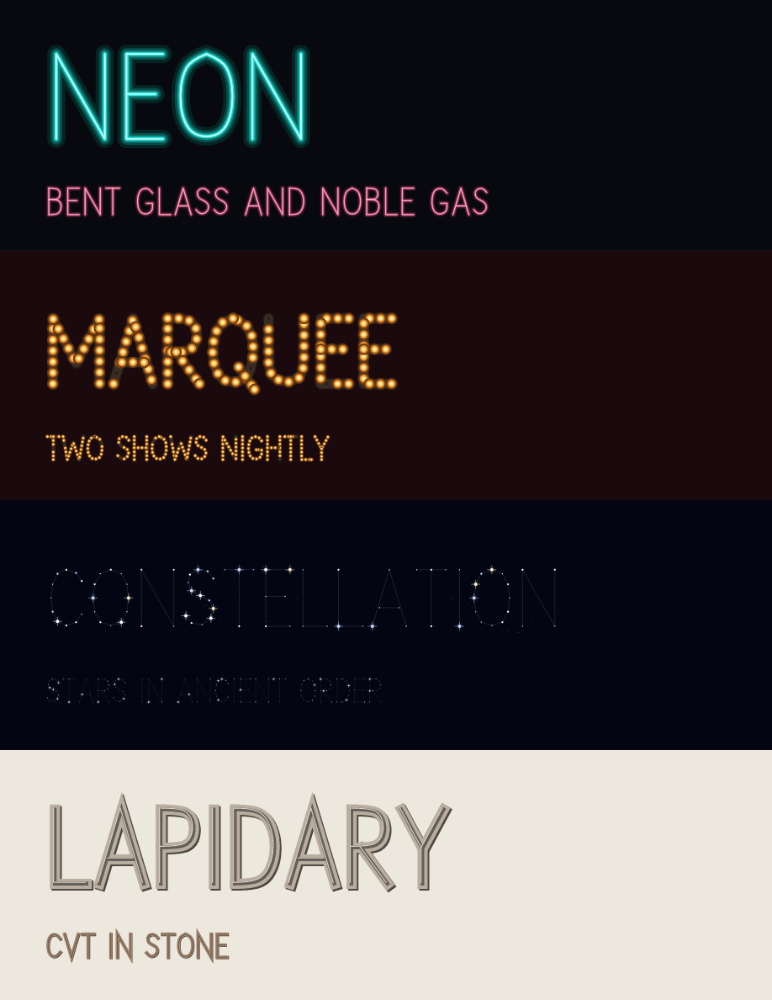
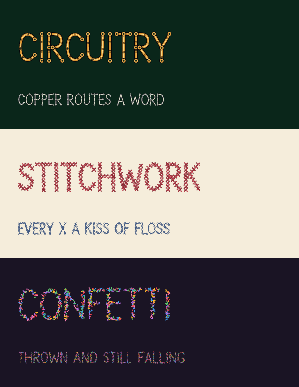
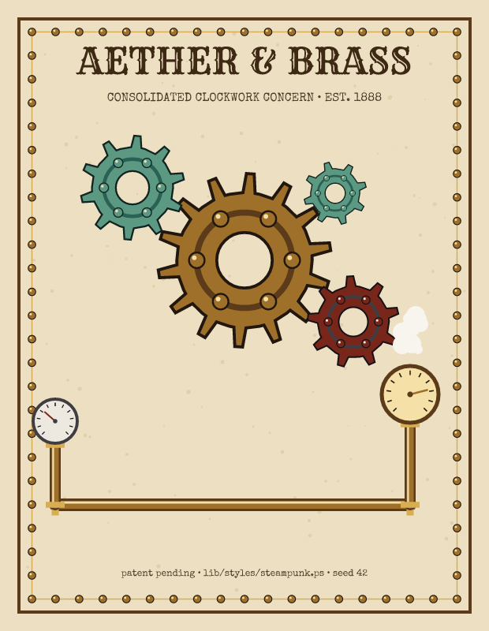
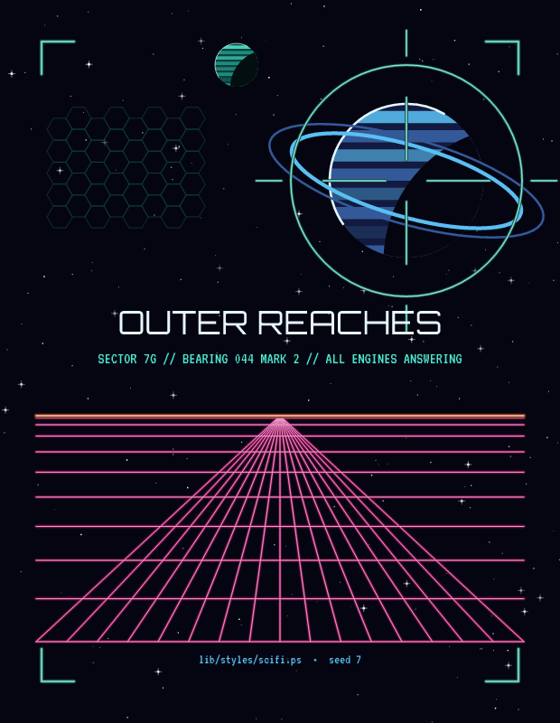
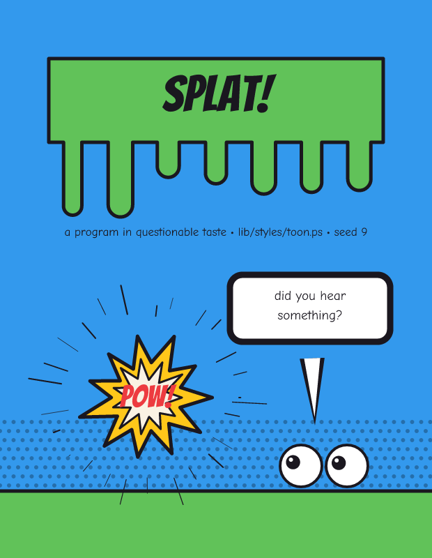

# pscat

A PostScript interpreter, written in Rust, for watching PostScript programs
draw live — built for personal fun rather than as a Ghostscript
replacement, though it's meant to grow toward broad spec coverage over
time.

**[jeromebanks.github.io/postscript_interpreter](https://jeromebanks.github.io/postscript_interpreter/)**
— docs, the full gallery, a font specimen for every face, and a live
playground running the interpreter in your browser tab, no install.

## Status

**All twenty roadmap stages are complete** (2026-07-19): 356 tests
across 35 suites, clippy clean, golden-checked against Ghostscript.
What follows is the tour, roughly in the order it was built.

**Stages 1–4 (the core)**: the language (tokenizer, object model,
three-stack interpreter, stack/arithmetic operators, `def`,
dictionaries, `if`/`ifelse`, `for`/`repeat`/`loop`/`exit`, comparisons,
`bind`), the graphics engine (paths, `arc`/`arcn`, `fill`/`eofill`/
`stroke`, `gsave`/`grestore`, colors and line attributes,
`translate`/`rotate`/`scale`), and a **live window** so you can watch
programs draw — or headless PNG rendering, cross-checked against
Ghostscript on the example fractals. Errors use the standard PostScript
error names and never panic on program input (fuzz-tested); runaway
recursion is a catchable `execstackoverflow`, and tail-recursive
programs run in constant execution-stack space.

**Stage 5 (run found PostScript)**: the idioms real-world `.ps` files
depend on — arrays and strings with true PLRM view semantics
(`get`/`put`/`getinterval`/`forall`/`aload`), dictionaries with
arbitrary keys and `<<>>` literals, type conversions (`cvi`/`cvs`/
`cvx`/…), catchable errors (`stopped`/`stop`/`$error`),
`search`/`token`, clipping, dash patterns, HSB/CMYK color, the full
matrix operator set, `//immediate` names, and ASCII85 strings.
`examples/testcard.ps` — written like a found file, shortcut prolog
and all — renders identically in pscat and Ghostscript.

**Stages 6–7 (text, files, images)**: text in three font technologies:

- **The standard base fonts** (Helvetica, Times, Courier families,
  backed by bundled metric-compatible Liberation faces) through the
  full operator set: `findfont`/`scalefont`/`makefont`/`setfont`/
  `selectfont`/`definefont`, `show`/`ashow`/`widthshow`/`awidthshow`/
  `kshow`, `stringwidth`, `charpath` (text as geometry), Standard and
  ISOLatin1 encodings with the PLRM re-encoding idiom.
- **Type 3 fonts** — glyphs that are programs: `BuildChar`/`BuildGlyph`
  run on the machine in sealed glyph contexts (see
  `examples/type3_ransom.ps`, where every glyph is invented fresh at
  show time), including bitmap fonts that stamp their raster with
  `imagemask`.
- **Type 1 fonts** — the real thing: `currentfile eexec`, encrypted
  charstrings via the `N RD <binary>` idiom, a hint-ignoring
  charstring interpreter with flex and seac. The test suite generates
  a complete PFA and Ghostscript accepts the identical bytes.

And the Stage 7 machinery underneath: **file objects** sharing one
read cursor with the scanner (`currentfile`, `read*`, `token`/`exec`
on files), **decode filters** (ASCIIHex, ASCII85, RunLength, Flate,
LZW, DCT/JPEG) as composable on-demand file layers, and **sampled
images** — `image`/`imagemask`/`colorimage` in both operand forms,
from string, file, filter-chain, or procedure data sources, through
the full CTM/clip pipeline. `examples/postcard.ps` shows it all
inline; `FONTS.md` has the font design writeup, `HANDOFF.md` the
state of the world.

**Stage 8 (VM fidelity)**: full `save`/`restore` semantics
(`VM.md` is the design writeup, pinned against Ghostscript), interned
names (fib 27 ~1.6× faster), Indexed/Separation color spaces, Level 2
odds and ends, and a found-file corpus — tiger.eps and the other gs
classics render block-identical to Ghostscript.

**Stage 9 (output targets)**: real multi-page `showpage`
(the window keeps showing the finished page; `--png` numbers pages),
`--dpi` for print-resolution rendering, and `--svg`/`--pdf` export —
both mirror the paint pipeline directly, and the PDF is verified by
letting Ghostscript rasterize it back. `--pdf` output is a real
document, not just a picture: `%%Title:`/`%%For:` DSC header comments
(issue #8) become the PDF's `/Info` metadata, so a multi-page piece
opens in a reader — Kindle's Send-to-Kindle and virtually any e-reader
or PDF viewer already take PDF directly, no separate export needed —
with an actual title instead of a filename. Level 3's `shfill`
operator (issue #20) paints axial and radial gradients — `ShadingType` 2/3 with
`FunctionType` 2/3 (exponential and stitching, so multi-stop ramps
work, not just two-color) — through the same three seams: real
tiny-skia gradients on the raster/window path, native
`<linearGradient>`/`<radialGradient>` in SVG, and a flat average-color
approximation in PDF (documented gap — real PDF shading needs pattern-
colorspace machinery this exporter doesn't have). `lib/artkit.ps`'s
`gradfn`/`axialsh`/`radialsh`/`gradfill` build shading dictionaries
from a plain array of `[r g b]` colors instead of requiring one by
hand; `examples/gradients.ps` is the specimen sheet.

`--sweep-seed`/`--sweep` (issue #21) render a file once per value in a
sweep instead of once, so exploring seeds or a parameter is one
invocation instead of N hand-edits: `--sweep-seed` overrides every
`srand` call transparently (found art with a hardcoded `N srand` line
sweeps unmodified), `--sweep NAME=` predefines `/NAME` in userdict for
a source that opts in to read it. `--png` writes numbered per-frame
files; `--contact-sheet PATH` composites every frame into one grid PNG
instead (`--grid COLSxROWS` overrides the default layout) — either or
both. `examples/sweep_demo.ps` is the specimen. CLI-only for now
(`pscat-mcp` doesn't expose a sweep tool — a documented scope cut, not
an oversight; see NOTES.md).

**Stage 10 (the LaserWriter experience)**: `--spool DIR`
turns the window into the printer in the corner of the lab — it
idles, watches a directory, and renders each `.ps`/`.eps` that lands
there, page by page, each job in a fresh interpreter. `--halftone`
screens the raster like a mono laser printer's RIP: classic
euclidean dots on a 45° lattice, coverage tracking darkness, for the
window and `--png`. Gallery II opened with *Hundred Lines*, the
Stage 12 handwriting font writing punishment lines on a chalkboard.

**Stage 11 (performance parity)**: `cargo bench --bench vs_gs` races
both interpreters on speed and peak memory. pscat starts 5× faster,
uses 3–5× less memory on every workload, and wins every rendering
page; the honest remaining gaps (fib ~2.3×, fern ~1.9×) and what was
done about them live in NOTES.md.

**Stage 12 (handwriting)**: `examples/handwriting.ps` — a Type 3
font whose glyphs are generated fresh per draw with rand-jittered
strokes, wandering baselines, and varying pen pressure. No two
letters ever match, every page is reproducible, and the same file
runs in Ghostscript.

Stages 13–20 each have their own section below: the handwrite tool,
agent integration (skill + MCP server), the Type 3 font library, the
browser/WASM build, the GitHub Pages site, the font catalog, the art
toolkit, and the style packs.

Try `cargo run -- --page 500x500 examples/sierpinski.ps` and watch the
triangles appear.

See `INIT.md` for the project vision, `ARCHITECTURE.md` for the design
writeup, `NOTES.md` for per-stage summaries, and `ROADMAP.md` for the
full staged plan (all stages complete, with per-task model routing).

## Building & running

Requires a stable Rust toolchain.

```sh
cargo run -- --page 500x500 examples/sierpinski.ps      # watch it draw, live
cargo run -- --speed 10 file.ps           # slower (steps per frame, default 100)
cargo run -- --png out.png file.ps        # headless render to PNG
cargo run -- --page 500x500 file.ps       # canvas size (default 612x792)
cargo run -- --spool jobs/                # act like a lab printer: render
                                          # each .ps/.eps dropped into jobs/
cargo run -- --halftone file.ps           # classic 45° halftone dots, like a
                                          # mono laser printer (window/PNG)
cargo run -- --lint --png out.png file.ps # self-check: blank page? unbalanced
                                          # gsave? stuff left on the stack?
cargo run -- file.ps --sweep-seed 1:12 \  # render 12 seeds, one grid PNG
    --contact-sheet grid.png
cargo run                                 # terminal REPL (headless canvas)
cargo run -- -i                           # REPL + live window: watch what you type draw
cargo run -- -i lib/handscript.ps         # ...with a library preloaded
cargo run -- -e '3 4 add ='               # evaluate a snippet
cargo test                                # language + pixel-level render tests
```

The `examples/` directory has three recursive fractals (Sierpinski
triangle, Koch snowflake, golden spiral), a found-file-style test card,
and a type specimen (`specimen.ps`); all render identically in pscat
and Ghostscript.

## Installing pscat without the repo

You don't need a git checkout or a Rust toolchain just to *use*
pscat. `scripts/package_release.sh` builds `pscat`/`pscat-mcp` and
bundles them with their runtime assets (`lib/`, `fonts/catalog/`,
`scripts/handwrite.sh`) into a standalone directory — CI does this
automatically and attaches the result to a
[GitHub Release](https://github.com/jeromebanks/postscript_interpreter/releases)
whenever a version tag is pushed (`.github/workflows/release.yml`).

To use one:

```sh
tar xzf pscat-<version>-<os>-<arch>.tar.gz
export PATH="$PWD/pscat-<version>-<os>-<arch>:$PATH"
pscat --png out.png some_file.ps
```

`lib/artkit.ps` and friends, and `fonts/catalog/`, resolve
automatically as long as they stay next to the `pscat` binary — the
whole point of the bundle layout. If you move the binary elsewhere,
set `PSCAT_ROOT` to wherever the bundle ended up (see `src/paths.rs`
for the full resolution order, which also covers running from a
`cargo build --release` checkout with no configuration, as before).

## Handwrite: string in, handwritten PNG out

```sh
./scripts/handwrite.sh "meet me at the bandshell at nine"
./scripts/handwrite.sh --size 44 --paper ruled --ink 0.5,0.1,0.1 \
    --seed 7 -o note.png "buy milk
call the bank about the thing"
```

Renders any string in the /HandScript dynamic font (Stage 12),
word-wrapped across lines the way a person fills a page — every
glyph is generated fresh, so repeated letters never match. The page
height is auto-sized to the text; newlines force line breaks, blank
lines are kept, and input is lowercased (the font has no capitals).

Options: `--size`, `--width`, `--height`, `--margin`, `--leading`
(line spacing × size), `--jitter` (0 = a calm hand), `--pen`,
`--ink R,G,B`, `--paper plain|ruled`, `--seed` (same seed, same
page), `--dpi`, `--halftone`, `-o out.png`. Run with `--help` for
the full list.

The business logic lives in `lib/handscript.ps` — the font plus a
dict-driven layout API (`hs-write` draws, `hs-linecount` measures;
the script auto-sizes pages by running the count headlessly first).
The library draws nothing on load and runs unchanged in
Ghostscript, so other applications can embed the file wholesale;
the options-dict schema is documented in its header.

## The font library

`lib/fonts/` — original display faces, each one a self-contained
pure-PostScript file that defines a Type 3 font and draws nothing on
load (the `lib/handscript.ps` doctrine: embeddable wholesale, runs
unchanged in Ghostscript). Because Type 3 glyphs are programs, the
letterforms do things outline fonts can't:

| Face | Material |
|---|---|
| `/Neon` | Bent glass tube — the glow is five widening strokes of overdraw, no alpha anywhere |
| `/Marquee` | Theater-sign bulbs along every stroke, halos, glints, and the occasional burnt-out bulb (seeded rand) |
| `/Constellation` | Letters as star charts: magnitudes and tints rand-drawn, hairline asterism lines, field stars |
| `/Lapidary` | Chiseled capitals: shadow, raised face, dark incision, and a hairline of sunlight on the arris |
| `/Circuitry` | Copper PCB runs — solder-mask channel, specular seam, through-hole pads at every terminal, vias at pitch |
| `/Stitchwork` | Cross-stitch X's pinned to the 45° aida grid, three passes of floss, a seeded-jitter hand |
| `/Confetti` | A thrown handful — paper slips and dots in a six-color party palette, still falling |

All seven share one capital skeleton set (both cases map to the same
capitals; digits and `.,-'!?` included) and take dials through their
scratch dicts — retube `/Neon` in pink, dial `/Marquee`'s burnout
rate, warm up `/Lapidary`'s stone, re-spool `/Stitchwork` in blue
floss. `examples/font_library.ps` and `examples/font_library2.ps`
are the specimen posters:

<p>
</p>

```sh
cargo run --release -- --png poster.png examples/font_library.ps
cargo run --release -- --png poster2.png examples/font_library2.ps
```

## The font catalog

`fonts/catalog/` — 58 libre outline faces loaded from disk at
`findfont` time (never compiled in; the binary and wasm stay lean).
With it, **every name in the classic LaserWriter 35 resolves to a
metric-compatible libre face**: the bundled Liberation faces cover
Helvetica/Times/Courier, TeX Gyre covers Palatino, Bookman, New
Century Schoolbook, Avant Garde, Zapf Chancery, and
Helvetica-Narrow, and the URW symbol faces give `/Symbol` and
`/ZapfDingbats` real glyphs with their proper PLRM encodings. On
top of that: 35 curated display and text families — Garamond to
Playfair, Poppins to Oswald, Great Vibes to Permanent Marker,
fraktur, western, horror, arcade, terminal, sci-fi, stencil, comic.

```sh
cargo run -- --fonts                 # list every reachable face and alias
cargo run -- -e '/Palatino-Roman findfont 24 scalefont setfont ...'
cargo run -- --png sheets.png examples/font_catalog.ps   # the specimen sheets
```

`fonts/catalog/README.md` is the manifest (families, genres,
licenses — all OFL, Apache 2.0, GUST, or AGPL-with-font-exception;
per-family license files ride alongside the fonts). Drop your own
`.ttf`/`.otf` into any subdirectory and `/<FileStem> findfont`
finds it. The [font gallery](https://jeromebanks.github.io/postscript_interpreter/fonts.html)
on the project site shows every face — Type 3 library included — one
card at a time.

## Making art

`lib/artkit.ps` is the generative-art toolkit: seeded random helpers,
eight mood palettes with color mixing, turtle graphics with a pose
stack, an L-system engine, shapes, layout and text helpers — and the
`pathforall`-powered brushes: `alongpath` stamps anything at even
arc-length along any path (`charpath` text included), and `pathtext`
sets type along a curve, each glyph rotated to the tangent — `ctext`
and `ctextctr` build on `pathtext` for the circular case specifically
(seals, coins, "ring of type" compositions), the latter centering the
string on the circle automatically. `walkpath` is a richer centerline
sampler for the same brush use case: alongside the stamp's position
and tangent it reports normalized progress along the current subpath,
the arc-length spacing since the last stop, and start/end flags —
including a guaranteed call at each subpath's literal endpoint, which
`alongpath`'s plain pitch-stepping can't promise — the foundation
painterly brushes (variable-width ribbons, tapered ends) build on. A tiling section adds a general
`lattice` walk, `hex`/`tri` shape primitives, `hexgrid`/`trigrid`
drivers for the two other regular tessellations, and `truchet` — a
single motif at a random quarter-turn per cell, the classic trick that
turns a regular grid into a flowing, maze-like pattern (see gallery's
Woven Labyrinth). A hyperbolic-geometry section models the Poincaré
disk: `hpoint`/`hpolar` place points by hyperbolic radius and angle,
`horthocircle`/`hgeo`/`hpoly` build individual geodesics and closed
geodesic polygons (circular arcs orthogonal to the unit disk, or
diameters through the origin), `hreflect` reflects across one (circle
inversion), and `httile` runs the reflections breadth-first to
generate a regular `{p,q}` tessellation of the whole disk from one
fundamental polygon (see gallery's Infinite Descent, a `{7,3}`
tiling). A fractals section adds `edgefractal`/`edgepoly` — a
Koch-style edge-replacement curve generalized to any turn-delta
generator (presets `/koch` and `/quadkoch` in `FractalGens`, retrieved
with `fgen`), walked around any closed polygon — and `gasket`/`carpet`,
Sierpinski-style recursive area subdivision for a triangle and a
square (see gallery's Recursive Peaks, gasket-faceted mountains under
a carpet-driven starfield). A noise/flow-fields section adds `noise2`
(2D gradient/Perlin coherent noise off a `srand`-shuffled permutation
table), `curl2` (turns any scalar field into a unit-vector flow by
taking its normalized perpendicular gradient), and `advect` (traces a
particle through a vector field as a sequence of `lineto`s) — see gallery's
Lodestone, iron filings curling around a magnetic stone. A scatter
section is the area-shaped counterpart to `alongpath`: `screct` and
`scpath` build a region from a rectangle or from the current path
(flattened and closed the way `fill` sees it — `clippath scpath`
captures the clip region), `scin` and `scarea` answer containment and
area, and `scatter` places a caller-supplied mark across the region by
fixed count or by density, with a `/Weight` procedure for non-uniform
distributions, seeded scale and rotation variation, exact
`/MinSpacing` enforcement, and a hard deposit budget (see gallery's
Firefly Census, a night meadow in which every mark on the page is
scattered rather than placed by hand). All of it
deterministic under `srand`, all of it running unchanged in
Ghostscript.

```postscript
(lib/artkit.ps) run
newpath 100 400 90 thome                        % a turtle...
(F) << (F) 0 get (F[+F]F[-F]F) >> 4 lsys        % ...an L-system...
4.4 22 ldraw stroke                             % ...a plant.
newpath 60 100 moveto 500 200 550 300 300 380 curveto
(text can walk along any path now) pathtext     % type on a curve
```

On top of the toolkit sit four **style packs** (`lib/styles/`), one
per aesthetic, each adding three palettes and a drawer of motifs:
`steampunk.ps` (gears, rivets, pipework, pressure gauges, riveted
plate frames), `psychedelic.ps` (sunburst rays, wobble-ring blobs,
spirals, kaleidoscope repeats, hue-wheel color), `scifi.ps`
(starfields, ringed planets, HUD chrome, hex shields, the synthwave
grid floor, and `glowstroke` to sell it all), and `toon.ps` (the
cel-cartoon look: `celfill` flats under fat ink, speech bubbles,
action bursts, speed lines, halftone `dotfill`, dripping title
slabs). Load artkit, then the pack; `examples/style_*.ps` are the
four specimen posters.

<p>


</p>

`gallery/hortus.ps` is the worked example, and the `psart` skill
(`.claude/skills/psart/SKILL.md`) teaches the whole workflow to any
agent: the render-look-refine loop, the toolkit, the style packs,
type as material, and the composition habits that keep pieces good.

A sibling library, `lib/graph.ps`, covers mathematical plotting
instead of freehand generative art: `setframe` maps a data-space
domain onto a device-space viewport, `plotfn`/`plotparam`/`plotpolar`
sample a function/parametric curve/polar curve into the current path,
and `axes` draws a bordered, ticked frame around them. A 3D side adds
`setview` (an azimuth/elevation camera), `project3`, and `plotsurface`
— a `z=f(x,y)` wireframe mesh, row by row and column by column, with
no hidden-surface removal (a deliberate scope cut; see the gallery's
Ripple Range for the cheap per-row-occlusion trick that works for a
single swept height field without needing a general solver). Neither
library depends on the other. `examples/graphing.ps` is a four-quadrant
specimen sheet exercising all four drivers.

```postscript
(lib/graph.ps) run
0 -1.2 6.283185 1.2 60 60 480 360 setframe   % domain -> viewport
newpath 0 6.283185 200 { sin } plotfn stroke % y = sin(x)
newpath 5 4 6 axes stroke                    % border + ticks
```

A second sibling, `lib/dataviz.ps`, covers chart-drawing instead of
mathematical plotting: `setdvframe` maps a value domain and category
count onto a device viewport, and `barchart`/`linechart`/`areachart`
read it directly — a per-element color callback (`{i v -> r g b}`,
same shape as artkit's `grid`) lets every bar or wedge pick its own
color, called before that element's path is built so a misbehaving
callback can't silently drop it. `scatterchart` has its own continuous
2D frame (`setscatterframe`, the same 8-arg shape as `graph.ps`'s
`setframe`); `piechart` draws pie wedges or, given a nonzero inner
radius, donuts — clockwise from 12 o'clock, the usual chart-library
convention. `dvaxes` decorates the categorical frame with a bordered,
ticked frame the same way `graph.ps`'s `axes` does. Independent of
both `artkit.ps` and `graph.ps`. `examples/dataviz.ps` is a six-panel
specimen sheet; the gallery's Field Notes pairs a bar chart and a line
chart on one shared category axis (weekly sightings against a
temperature trend) alongside a species-mix donut.
For papers and documents, both libraries have plain, paper-ready counterparts distinct from the stylized gallery pieces: `examples/graph_paper.ps` (a single framed `plotfn` figure with axes and labels) and `examples/dataviz_paper.ps` (bar, line, pie and scatter panels on one white page). An interactive counterpart lives at `site/charts.html` (mirroring `site/playground.html` but scoped to these two libs — pick a preset, edit the data or function, see it render live), and agents have a dedicated skill at `.claude/skills/psviz/SKILL.md` (alongside `pscat`/`psart`) that teaches the calling conventions and copy-paste templates so a data-visualization request goes straight to `graph.ps`/`dataviz.ps` instead of the generative-art loop.


```postscript
(lib/dataviz.ps) run
0 10 60 60 480 360 setdvframe                  % value range -> viewport
newpath [3 7 2 9 5] 0.25 { pop dvcolor } barchart
newpath 5 4 6 dvaxes stroke                     % border + ticks
```

A third sibling, `lib/etching.ps` (issue #15), turns a photograph into
a line engraving — the reproduction technique old newspapers and books
actually used before halftone screens, not edge detection. `et-dims`
reads a JPEG's own SOF marker (segment-skipping, not byte-scanning) to
get its width/height/component count without decoding it; `et-draw`
opens the same file through `/DCTDecode` — a general filter in this
interpreter, so a PS program can `readstring` decoded samples directly
without going through the `image` operator — and hatches it: parallel
lines whose stroke width tracks local darkness, plus a perpendicular
crosshatch pass in the deep shadows. No new Rust code; the interpreter
already had every building block this needed. Draws with ordinary
`moveto`/`lineto`/`stroke`, so it renders to `--png`/`--svg`/`--pdf`
alike. `scripts/photo_etch.sh` wraps it end to end (photo path in, PNG/
SVG/PDF out — no PostScript required); `examples/etching_demo.ps` is a
specimen sheet.

```postscript
(lib/etching.ps) run
<< /Photo (photo.jpg) /PageWidth 320 /PageHeight 240 >> et-draw showpage
```

A fourth sibling, `lib/pagekit.ps` (issue #18) -- but, like the style
packs, it *does* depend on `artkit.ps`, leaning on `tfblock` for
paragraph flow, `showctr`/`rrect` for layout, and `Palettes`/`pal` for
color. Five parameterized document templates --
`pgcard`/`pgletter`/`pgcertificate`/`pginvitation`/`pgposter` -- each
take `x y w h dict pgNAME` (the usual bottom-left-plus-size
convention) and a content dict of optional keys (title, body copy,
signature, and a few template-specific fields), so an agent fills in a
message without making layout decisions itself; every template
returns whatever body text didn't fit, the same leftover contract
`tfblock` already establishes. Two new palettes, `/vellum` and
`/marigold`, join artkit's eight -- registered the same way a style
pack registers its own, since (checked directly, not assumed) not
every one of artkit's mood palettes actually runs dark to light.
`examples/template_*.ps` is one specimen per template.

```postscript
(lib/artkit.ps) run
(lib/pagekit.ps) run
40 40 532 500
<< /Awardee (Ada Lovelace) /Body (For contributions to computing.)
   /Presenter (C. Babbage) /Date (1843-10-12) >>
pgcertificate pop showpage
```

A fifth sibling, `lib/paintkit.ps` (issue #41), is the foundation for a
painterly-brush series: `pkribbon` treats the current path as a
centerline and fills a variable-width ribbon along it, built on
artkit's `walkpath` centerline sampler (issue #40). One dict-driven
entry point -- base width, a `{t -> mult}` pressure profile over
normalized path progress (three presets ship: constant, linear taper,
and a non-linear bell curve), start/end taper, round/flat/pointed
caps, and seeded edge jitter -- with color left to the caller, same as
any other artkit shape helper. Multiple subpaths each become their own
ribbon; closed subpaths fill as two concentric loops with no caps;
degenerate paths fall back to a dot or a no-op rather than erroring.
`examples/paintkit_demo.ps` is a specimen sheet of all three
centerline shapes, all three pressure profiles, all three cap styles,
and jitter. `pknib` (issue #42) is an angled-nib calligraphy preset
built on `pkribbon`: mark width tracks the angle between local path
direction and a fixed `/Angle`, widest perpendicular to the nib and
narrowing toward a `/MinWidth` floor parallel to it, composing with
`pkribbon`'s own pressure/taper/jitter. It requires a single open
subpath (one call per stroke). `examples/paintkit_nib_demo.ps` shows
the same path at several nib angles, corners, a direction reversal,
broad-edge lettering strokes, and a flourish. `pkdry` (issue #43) is a
dry-bristle brush, also built on `pkribbon`: a bounded family of thin
offset bristles scattered across the centerline, each broken into
ink/no-ink runs by a seeded two-state Markov chain (`/Load` the
resume-contact rate, `/Dropout` the lose-contact rate, both expressed
per one `/Width` of travel so the same numbers read as the same
dryness regardless of `/Pitch`) -- ranging from a mostly loaded stroke
to visibly broken dry-brush texture with no raster work, every dash
its own small `pkribbon` call. `/Bristles` is hard-capped at 1..100,
and bristle count times raw sample count is checked against a fixed
deposit budget before any drawing starts, the two safety limits
against an accidentally unbounded render. `examples/paintkit_dry_demo.ps`
shows loaded/medium-dry/very-dry presets, bristle count/spread/width-
jitter variation, small per-bristle color variation, and a flourish.
`pkspray` (issue #44) is a spray-paint brush -- the one preset not
built on `pkribbon`, since spray is discrete particle deposition rather
than an offset band: seeded opaque particles scattered around each
sampled centerline stop under a radial falloff (three discrete levels,
min-of-m-uniforms draws, no pow/exp), an optional overspray mist
escaping past the nozzle edge, per-particle size variation, and
optional trigger-dwell bursts pooling particles at each subpath's
ends. Total deposits track arc length (about `/Density` per
nozzle-diameter of travel) regardless of `/Pitch`, and are bounded by
a deposit-budget safety limit checked during the counting pass, before
any drawing. Stencils need no library support: particles are plain
fills, so any active clip (`charpath` + `clip` included) masks them.
`examples/paintkit_spray_demo.ps` shows a clean pass, a wide aerosol
pass, heavy overspray, the falloff levels, a word sprayed through a
charpath stencil, a star sprayed through an arbitrary-path stencil,
and a tag mark with bursts pooled at both ends.

`pkwash` (issue #47) is the watercolor medium, and the one preset here
that needs something from the interpreter rather than only from
PostScript: it fills the current path as a *translucent* wash. Two new
operators back it — `setalpha`/`currentalpha` and `setblendmode`/
`currentblendmode` (`/Normal` or `/Multiply`), pscat extensions rather
than PLRM operators, living on the graphics state so `gsave`/`grestore`
snapshot them like any other paint attribute, and exported by `--svg`
(`fill-opacity`/`stroke-opacity`, `mix-blend-mode`) and `--pdf` (an
`ExtGState`'s `ca`/`CA`/`BM`) as well as `--png`. They reach fills,
strokes, text and `shfill`; they do **not** reach `image`/`imagemask`,
which blit their own samples. The wash itself is still pure vector
geometry: `/Layers` translucent passes, each with its own boundary
wobbled off the given path by `/Wet` (a harmonic ladder at integer
multiples of path progress, so a closed boundary joins seamlessly),
`/Bloom` edge pooling drawn as a stroke clipped to the wash so it
can't leak outside, and optional `/Grain` granulation — no diffusion
solver anywhere. `/Blend /Multiply` makes wash order commute, which
plain source-over does not. `pkpaper` lays the ground it sits on: tone
plus seeded grain and fibers. Both are deterministic under `/Seed`, or
under the caller's own `srand` without one.

This is also the first thing in this repo that does **not** render the
same way under plain `gs file.ps`: Ghostscript has no
PostScript-callable alpha operator at all. Rather than error there,
`pkwash`/`pkpaper` probe for `setalpha` at load and fall back to
painting each mark in its flattened-over-white equivalent — legible,
but overlaps stop mixing. Verified alpha output goes through `--pdf`
instead, which gs's own PDF interpreter renders correctly.
`docs/WATERCOLOR.md` is the decision record behind all of it (issue
#46's architecture spike), `examples/paintkit_wash_demo.ps` is the
specimen sheet, and the gallery's First Rain is the piece.

```postscript
(lib/artkit.ps) run
(lib/paintkit.ps) run
newpath 40 40 moveto 60 120 260 120 280 40 curveto
<< /Width 24 /Pressure { pktaper } >> pkribbon showpage
```

```postscript
0 0 612 792 << /Grain 0.6 >> pkpaper            % the paper first
0.2 0.35 0.7 setrgbcolor
newpath 300 500 120 0 360 arc closepath
<< /Alpha 0.3 /Layers 3 /Wet 8 /Bloom 0.6 >> pkwash   % then the wash
```

A sixth sibling, `lib/hatchkit.ps` (issue #49), is a reusable hatching
and cross-hatching library: `hatch` fills whatever region is currently
clipped with a family of parallel line strokes, so the caller supplies
the region and any tone-driving callback rather than this library
doing image analysis or tone extraction (`lib/etching.ps` already
covers that end-to-end). It never reimplements point-in-polygon or
edge-crossing tests -- lines are drawn well past the region's
boundary and left for the graphics state's own `clip` to cut down, so
`hatch` clips to concave and self-intersecting paths exactly as well
as convex ones. Single or multi-angle (`/Angles`, layered per call --
two calls at 90 degrees apart is the classic cross-hatch), seeded
width/wobble/dropout/length variation, and an optional per-sample
`/Density` callback that drives width buckets and a no-ink cutoff --
clamped into `[0,1]` regardless of what the callback returns, so a
misbehaving callback can only change tone, never spawn unbounded
geometry. `/MaxLines` and `/MaxSamples` reject a pathological
`/Spacing` before anything is drawn, the same up-front-reject shape
`scatter`'s `/Budget` uses. `examples/hatching.ps` is a three-panel
specimen sheet: flat shading, a `/Density`-driven tonal band that
reads as a curved, lit sphere despite every stroke being straight, and
layered cross-hatching built from two and three `hatch` calls over the
same region.

```postscript
(lib/hatchkit.ps) run
newpath 40 40 moveto 260 40 lineto 260 260 lineto 40 260 lineto closepath clip
<< /Angle 30 /Spacing 4 /Seed 1 >> hatch
```

An eighth sibling, `lib/halftonekit.ps` (issue #53), covers print
screens: `halftone` fills whatever region is currently clipped with a
regular dot, line, or cross-line lattice, one mark per cell sized by a
tone (a number, or a `{x y -> w}` callback clamped into `[0,1]`), with
a per-layer `/Offset` for controlled misregistration -- one call per
ink, each with its own color, angle, and shift, is a two-plate
risograph spread. Frequency is cells-per-inch, dots scale by
square-root (area-proportional, the print-correct curve), and a single
deterministic `/MaxCells` budget rejects pathological lattices before
anything is drawn. No random draws anywhere, so fixed options
reproduce identically with no seed to manage. `examples/halftone.ps`
is a four-panel specimen: a dot ramp, a line screen, a cross screen,
and a misregistered second plate.

```postscript
(lib/halftonekit.ps) run
newpath 40 40 moveto 200 40 lineto 200 200 lineto 40 200 lineto closepath clip
<< /Screen /dot /Frequency 9 /Tone 0.5 >> halftone
```

A ninth sibling, `lib/surfacekit.ps` (issue #51), is a library of
deterministic, seeded surface textures meant to sit under other marks
the way a real surface sits under ink: `grain` (paper grain), `fiber`
(paper fibers), and `scuff` (scratches and scuffs) are thin wrappers
over `scatter` (issue #48), the same "no new placement engine" choice
`lib/stipplekit.ps` made; `misreg` (print/registration imperfections)
is too, drawing nested lightening rings instead of a single mark;
`weave` (canvas weave) is its own grid-and-`scin` loop instead, since a
basket weave is a regular structure, not a random one, with its own
two independent pre-flight budgets mirroring `hatch`'s own
`/MaxLines`/`/MaxSamples` shape. New `/Color`/`/Strength` options lerp
each mark from paper-white toward a given color rather than toward
transparent (gs has no PostScript-callable alpha operator). A caller
needing an exact edge on a non-rectangular region clips the ambient
graphics state first, the same idiom `hatch` itself relies on.
`examples/surfacekit.ps` is a six-panel specimen sheet: one per preset,
plus a sixth demonstrating that exact-edge clip.

```postscript
(lib/artkit.ps) run
(lib/surfacekit.ps) run
0 0 200 200 screct << /Density 0.4 /Scale [0.4 1.4] /Seed 3 >> grain
```

A tenth sibling, `lib/printkit.ps` (issue #52), composes `hatch`,
`scatter`, and (optionally) `grain` into three printmaking presets --
`woodcut`, `linocut`, `engraving` -- over a shared options dict
(`/Scale`, `/Density`, `/Roughness`, `/Seed`, `/Color`, `/Budget`,
`/Paper`, `/Angle`). Unlike its `region opts NAME` siblings, each
preset takes the *current path* directly and manages its own `clip`
internally -- no pre-clip, no `screct`/`scpath` region object, needed
from the caller -- since rebuilding an exact `clip`-able path back out
of a stored region's flattened edge soup would be real machinery for
no benefit over the path the caller already has. `woodcut` is one
directional hatch pass (the grain) at high wobble/dropout/trim plus a
scatter of small jittered chip marks; `linocut` is one bold, low-wobble
pass plus a sparse scatter of a few large, more deliberate marks;
`engraving` is a single `hatch` call sweeping three angles 60 degrees
apart at fine spacing and minimal wobble -- no chip marks. `/Paper
true` layers a subtle `surfacekit` `grain` pass under the ink, inside
the same clip. `examples/printkit.ps` is a four-panel specimen sheet
(one per preset, plus a `/Paper true` panel); the gallery piece
*Nightfall, Three Cuts* uses all three in one scene, each silhouette
inked solid first and then cut a second time with a lighter `/Color`
for the moonlit-highlight look real relief printing gets from gouging
ink away.

```postscript
(lib/artkit.ps) run
(lib/hatchkit.ps) run
(lib/surfacekit.ps) run
(lib/printkit.ps) run
newpath 40 40 moveto 260 40 lineto 260 260 lineto 40 260 lineto closepath
<< /Seed 5 >> woodcut
```

## The website

**[jeromebanks.github.io/postscript_interpreter](https://jeromebanks.github.io/postscript_interpreter/)**
— architecture and extending guides, the full art/font/example
gallery, a dedicated [font gallery](https://jeromebanks.github.io/postscript_interpreter/fonts.html)
(every Type 3 face and every catalog family, one card each), and a
live playground running the wasm interpreter, all in the browser, no
install. Published from this repo by `.github/workflows/pages.yml`
(GitHub Pages, "GitHub Actions" source) on every push to `main`.
Sources in `site/`; `./scripts/build_site.sh` assembles `_site/` for
local preview (`python3 -m http.server -d _site`) — it also renders
the font gallery cards (`scripts/build_font_gallery.sh`) and the
example/gallery stills fresh each time, so the site never drifts from
what the interpreter actually does.

## In the browser

The interpreter core compiles to WebAssembly, and `web/pscat.js` is
a dependency-free ES module that renders — and *executes* —
PostScript in a browser, including step-driven drawing into a
`<canvas>`: the live window, in a tab.

```sh
./scripts/build_wasm.sh              # → web/pscat.wasm (~5.5 MB; the bundled base fonts)
python3 -m http.server -d web        # open http://localhost:8000
```

```js
import { Pscat } from './pscat.js';
const ps = await Pscat.load();
ps.run('0 0 300 300 rectfill showpage');   // to completion...
ps.paintTo(canvas);

ps.begin(source);                          // ...or watch it draw:
const frame = () => {
  if (ps.step(300) === 1) requestAnimationFrame(frame);
  ps.paintTo(canvas);
};
requestAnimationFrame(frame);
```

`web/index.html` is a ready-made playground (editor, speed slider,
live canvas). Errors come back REPL-style via `ps.error` with the
standard PostScript error names. The wasm build has no window, no
filesystem, and no clock (`usertime`/`realtime` read 0 — the one
documented deviation). Works under node too — `tests/wasm.rs` drives
the real module through the same JS library.

## For agents

pscat is easy to drive from a coding agent — Claude Code, Codex,
OpenClaw, Hermes, or anything else. Two integration surfaces:

**Docs-reading agents**: `.claude/skills/pscat/SKILL.md` is the
one-page tool reference (Claude Code picks it up automatically as a
skill; it's plain markdown, so any agent can read it). `AGENTS.md`
points there too, which is where Codex looks first.

**MCP-wired agents**: `pscat-mcp` (built alongside `pscat`) is an
MCP server over stdio exposing four tools:

- `render_postscript` — source in; PNG image(s) back inline (or SVG
  text, or a PDF written to `out_path`), with page size, `dpi`, and
  `halftone` options. Errors still return the partial render. Also
  runs the self-check/lint pass (issue #17, `--lint` on the CLI) and
  appends a `Lint:` block when it finds something — a blank page, an
  unbalanced `gsave`, stuff left on the stack — so a whole class of
  silent failure shows up without eyeballing the PNG.
- `handwrite` — text in, handwritten-note PNG back (the
  `scripts/handwrite.sh` options: size, paper, ink, jitter, seed).
- `describe_art_capabilities` — the machine-readable catalog of what
  this build's creative toolkit actually has installed: fonts, Type 3
  program faces, mood palettes, page templates, and artkit/style-pack
  procedures (issue #39, `--capabilities` on the CLI). See
  CAPABILITIES.md.
- `eval_postscript` — run headlessly, get back what the program
  printed, or the standard error name plus an operand-stack
  post-mortem.

Register it:

```sh
cargo build --release
claude mcp add pscat -- $PWD/target/release/pscat-mcp     # Claude Code
codex mcp add pscat -- $PWD/target/release/pscat-mcp      # Codex
```

For OpenClaw, Hermes, or any other MCP client, the generic stdio
config is:

```json
{ "mcpServers": { "pscat": { "command": "/path/to/target/release/pscat-mcp" } } }
```

The server shells out to the `pscat` CLI (found next to it), so the
tools always match the CLI's behavior. `handwrite` also needs
`scripts/handwrite.sh` — resolved the same way as `pscat`/`lib`/
`fonts/catalog` (see "Installing pscat without the repo" above), so
a release bundle needs no extra setup; set `PSCAT_ROOT` only if
you've moved the binaries away from their `lib`/`fonts`/`scripts`
siblings.

## Gallery

`gallery/` holds generative-art programs written in pure PostScript for
this interpreter, each *within the operator set it had at the time*.
The six Stage 3 originals predate `rand`, `sethsbcolor`, and arrays, so
they carry their own linear-congruential random generator and HSB→RGB
converter as PostScript procedures; Ring of Type is built on Stage 6's
fonts. Everything is deterministic; change a `/seed` and a different
tree or fern grows.

| Piece | Technique |
|---|---|
| `golden_bloom.ps` | Phyllotaxis — 1,300 florets at the golden angle, √-spaced like a sunflower |
| `cathedral_rose.ps` | Maurer rose — straight chords walking r = sin 6θ in 71° / 97° strides weave lace |
| `ember_tree.ps` | Recursive branching from an LCG, banded dusk gradient, layered sun glow |
| `fern.ps` | Barnsley chaos game — 48,000 points over four affine maps, no outline drawn |
| `silk_waves.ps` | 66 threads displaced by two interfering sine fields |
| `frost_mandala.ps` | Six-fold circle recursion, 11° twist per generation — 1,555+ circles |
| `ring_of_type.ps` | (Stage 6) one sentence circling eleven shrinking rings, set glyph by glyph around a charpath ampersand |
| `hundred_lines.ps` | (Stage 10) the Stage 12 /HandScript dynamic font writing punishment lines on a chalkboard — same sentence nine times, no two letters alike |
| `hortus.ps` | (Stage 19) a herbarium plate: three L-system plants grown by turtle, blossoms stamped along each plant's own path with `pathforall` |

View them one at a time:

```sh
./gallery/show.sh          # step through the rendered PNGs
./gallery/show.sh --live   # watch each piece draw itself in a window
```

<p>
  
  
  
</p>
<p>
  
  
  
</p>
<p>
  
</p>

Details, page sizes, and re-render instructions live in
`gallery/README.md`.

A REPL taste:

```
PS> 40 2 add =
42
PS> mark 1 2 3
PS<4> pstack
3
2
1
-mark-
```

More sample programs live in `examples/`.

## Why

I used to write raw PostScript by hand in college and send it straight to
a LaserWriter. This is a from-scratch Rust interpreter built to relive
that — watching a hand-written recursive PostScript program draw itself,
live, without depending on a decades-old C codebase to do it.

<!-- sdlcify:managed:start -->
## SDLC

See [`SDLC.md`](SDLC.md) for how this repo's development lifecycle
works (issue → branch → PR → review → merge → cleanup) and the
branch-protection/merge policy currently enforced on GitHub — generated
and kept in sync by the `sdlcify` skill.
<!-- sdlcify:managed:end -->
