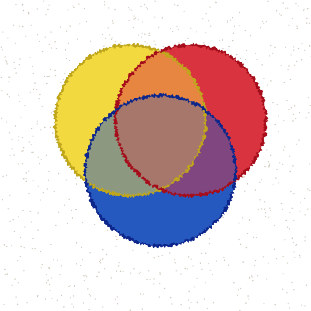
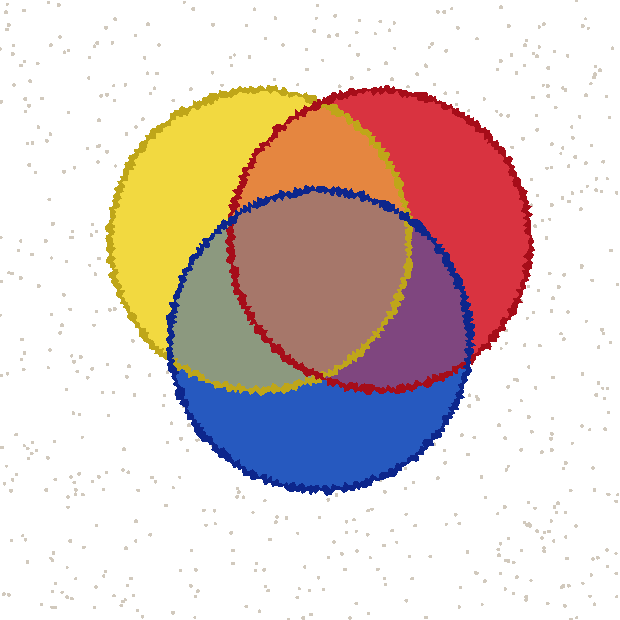

# WATERCOLOR.md — watercolor rendering architecture spike (issue #46)

A time-boxed comparison of three ways to get watercolor-like
translucency, pooling, and bloom out of pscat: pure PostScript,
a small renderer-level extension, and an external raster post-pass.
All three render the same scene (`docs/watercolor_prototypes/
common_gesture.ps`) so the comparison is of the mechanism, not of
three unrelated pieces of art. This document is the decision record
issue #46 asks for; it recommends an architecture and a public
contract for #47 to implement, not a finished watercolor library.

## The shared scene

Three overlapping washes arranged as a Venn diagram — yellow, crimson,
ultramarine, in a triangular arrangement with a shared triple-overlap
region. Chosen because a 3-circle Venn diagram is the smallest scene
that exercises every interesting case (single-wash color, pairwise
mixing, triple mixing) while staying small enough for Approach A's
technique to do by hand (2³ = 8 regions, one empty). Every prototype
below renders the exact same three circles and colors —
`docs/watercolor_prototypes/common_gesture.ps` is the single source of
truth for PostScript; Approach B's Rust test transcribes the same
numbers by hand (there's no shared build between Rust and PostScript
here) with a comment pointing back at this file.

## Approach A — pure PostScript

`docs/watercolor_prototypes/approach_a_pure_ps.ps`, built on `(lib/
artkit.ps)` and #41's `pkribbon`. Three techniques stacked:

1. **Real overlap-color mixing via nested `clip`.** `clip` intersects
   with whatever is already clipped, so `circA clip circB clip` *is*
   "inside A and inside B" — no path-boolean library needed. Each of
   the 7 non-empty regions is repainted with its own precomputed
   blend color, from broadest (three full circles) to narrowest
   (the triple intersection), so occlusion order doesn't matter by
   the time the last region is painted.
2. **A hand-painted edge**, tracing each circle's own boundary as a
   closed centerline through `pkribbon` — a closed subpath renders as
   two concentric loops per its own documented contract, giving a wet
   ink ring instead of a flat vector outline. This is the literal
   "common gesture baseline" dependency on #41.
3. **Paper grain**, ~900 small scattered dots painted *first*, so they
   only show in the gaps between washes.

Rendered with pscat:



**Verified against real Ghostscript** (`gs -dNOPAUSE -dBATCH -dNOSAFER
-sDEVICE=png16m ... approach_a_pure_ps.ps`, no pscat-specific
operators used) — clean run, visually equivalent modulo minor
anti-aliasing/tessellation differences:



**This is the honest ceiling of the technique, and it's higher than
the issue's own framing assumes.** A hand-tuned 3-circle Venn diagram
looks convincing. The real limits are structural, not cosmetic:

- **Combinatorial blowup.** N overlapping washes need up to 2ᴺ region
  fills, each needing its own precomputed blend color, hand-ordered
  broadest-to-narrowest. Three washes is 7 non-trivial regions,
  already written out by hand above; ten washes would be intractable
  as hand-authored PostScript. A generative composition with many
  strokes (the real target for #47, not a fixed 3-blob demo) cannot
  use this technique directly.
- **The blend colors are guessed, not computed.** `common_gesture.ps`'s
  `mix2`/`Color123` are a naive element-wise average, picked once by
  hand and baked in — not a pigment model, and not the renderer doing
  real compositing math. A different pair of washes needs a new guess.
- **Paper grain can't show through an opaque wash.** The scatter dots
  are visible in the white gaps and invisible under every filled
  region, because there's no transparency for them to show through.
  Real watercolor paper texture reads faintly even under a wash.

## Approach B — small renderer-level extension

tiny-skia (already a pscat dependency — `paint.set_color_rgba8(r, g,
b, a)`) does real alpha compositing internally; pscat's own `Gfx::
paint()` just hardcodes `a = 255` today. Exposing it is small: a new
`alpha: f32` field on `GraphicsState` (so `gsave`/`grestore` snapshot
it automatically, for free, the same way every other paint attribute
already works) and one line in `paint()` reading it instead of the
literal `255`.

**This issue deliberately does not add a public operator.** #47's own
acceptance criteria say "existing PNG/SVG/PDF behavior remains
unchanged" — a `setalpha` that only affects the PNG path (this
prototype adds no SVG/PDF wiring) would make `--svg`/`--pdf` silently
diverge from the raster the moment a program used it, the same bug
class NOTES.md records fixing for stroke/PDF in issue #8. Landing that
now would hand #47 a broken public operator as its starting point.
Instead, `alpha` is `pub(crate)` only — reachable from nowhere in the
PostScript language — and exercised by a single `#[ignore]`d Rust test,
`gfx::tests::watercolor_prototype_b_alpha_sample`, that builds the
same three circles directly through `Gfx`'s existing path/fill methods
and pokes `state_mut().alpha` between fills. `cargo build`/`clippy`/
`fmt` cover it like any other code in the crate; `cargo test` skips it
by default since it exists to regenerate a sample image, not to assert
a behavior. Run it with:

```
cargo test --release watercolor_prototype_b_alpha_sample -- --ignored
```


No hand-picked blend colors here — this is what the renderer actually
computes from `alpha = 0.55` on each of three source-over fills.
Notice the triple-overlap region is visibly *not* symmetric the way
Approach A's hand-picked color is: painting 1-then-2-then-3 under
source-over compositing is order-dependent (each new fill blends into
whatever's already there), which is a real, honest property of this
mechanism worth calling out rather than hiding — #47 will need to
either document it as expected ("later strokes read as wetter/fresher
paint over drier ones," which is arguably *more* watercolor-authentic
than a symmetric blend) or add explicit blend-order control. This
sample also deliberately omits Approach A's brush-edge and grain
polish — it isolates the compositing mechanism, not a finished look;
see "Combining approaches" below for what B looks like with C's
polish layered on top.

**Ghostscript portability — tested, not assumed.** Every paintkit
preset in this repo is verified against real `gs`
(`ghostscript_accepts_paintkit`, and each of #42/#43/#44's demos ran
through `gs` directly). Before writing anything, this spike checked
whether `gs` has an equivalent, PostScript-callable alpha operator:

```
$ gs -dNOPAUSE -dBATCH -dNOSAFER -q -sDEVICE=nullpage \
    docs/watercolor_prototypes/gs_alpha_check.ps
.setfillconstantalpha: no
.setopacityalpha: no
.setstrokeconstantalpha: no
setalpha: no
```

None of gs 10.07.1's internal transparency operators (`.setfillconstantalpha`,
`.setopacityalpha`, `.setstrokeconstantalpha`) are reachable from a
plain `.ps` program run with `gs file.ps` — gs's real transparency
support lives inside its PDF interpreter (transparency groups, `ca`/
`CA` via `ExtGState`), not as a PostScript-level operator. **A watercolor
medium built on this mechanism would be the first paintkit-adjacent
feature that doesn't render under plain `gs`** — a real, first-of-its-
kind cost, not a hypothetical one. It doesn't disqualify the approach
(SVG/PDF export already give #47 a path to *some* portability — see
"Public contract for #47" below — and gs's own PDF-writer device does
understand alpha, just not through a script-callable operator), but it
must be named explicitly rather than assumed away.

## Approach C — external raster post-pass

`docs/watercolor_prototypes/common_base_opaque.ps` renders the
plainest possible base — three flat, opaque, unblended circles, no
grain, no brush edges — specifically so the post-pass's contribution
can be judged on its own, the same way Approach B's test isolates just
the compositing mechanism rather than reusing Approach A's polish.


A small Python script (Pillow + NumPy — **deliberately not part of
this repo's Rust toolchain**, kept out of the tree entirely and
reproduced here in full instead of committed, since the fact that it
*can't* live in the toolchain is itself the argument against this
approach) applies a smooth-noise domain warp (wobbly, bleeding edges),
a Gaussian blur, and multiplicative fine-grain noise:

```python
#!/usr/bin/env python3
"""watercolor_approach_c_post_process.py <in.png> <out.png>"""
import sys
import numpy as np
from PIL import Image, ImageFilter


def smooth_noise(h, w, rng, cell=48, blur_passes=3):
    small = rng.uniform(-1.0, 1.0, size=(h // cell + 2, w // cell + 2))
    img = Image.fromarray((small * 127 + 128).astype(np.uint8), mode="L")
    img = img.resize((w, h), Image.BICUBIC)
    for _ in range(blur_passes):
        img = img.filter(ImageFilter.BoxBlur(cell // 4))
    return (np.asarray(img).astype(np.float32) - 128.0) / 127.0


def main():
    in_path, out_path = sys.argv[1], sys.argv[2]
    rng = np.random.default_rng(46)  # issue number as the seed

    base = Image.open(in_path).convert("RGB")
    w, h = base.size
    arr = np.asarray(base).astype(np.float32)

    dx = smooth_noise(h, w, rng, cell=40) * 6.0
    dy = smooth_noise(h, w, rng, cell=40) * 6.0
    ys, xs = np.mgrid[0:h, 0:w].astype(np.float32)
    src_x = np.clip(xs + dx, 0, w - 1).astype(np.int32)
    src_y = np.clip(ys + dy, 0, h - 1).astype(np.int32)
    warped = arr[src_y, src_x]

    warped_img = Image.fromarray(warped.astype(np.uint8))
    blurred = warped_img.filter(ImageFilter.GaussianBlur(2.2))
    out = np.asarray(blurred).astype(np.float32)

    grain = smooth_noise(h, w, rng, cell=6, blur_passes=1) * 0.06 + 1.0
    out = np.clip(out * grain[..., None], 0, 255)

    Image.fromarray(out.astype(np.uint8)).save(out_path)


if __name__ == "__main__":
    main()
```


**The unexpected, load-bearing finding of this spike:** post-processing
a *flattened, already-opaque* render cannot recover pigment-pooling.
The blur/warp softens edges and adds grain, but the blue circle is
still fully occluding whatever it was painted over — there was never
any transparency information in the PNG for a raster filter to work
with. Achieving real pooling through Option C would require exporting
each wash as a *separate* alpha-bearing raster layer for the external
tool to composite itself — real added architecture (a multi-layer
export format, a compositing-order contract, provenance for each
layer), not just "pipe the PNG through a filter." That pushes Option C
much closer to "an oversized paint simulator hidden [outside] the
interpreter" than its framing in the issue suggested, and it's a real
cost this spike would not have priced correctly without actually
running the experiment.

**As a bonus** (not part of the standalone C evaluation, but relevant
to "smallest approach"): running the identical post-pass over
Approach B's already-alpha-composited render, instead of the bare
opaque base, produces the best-looking single image in this spike:


That's evidence C is best understood as an optional *polish* layer
compatible with either A or B, not a standalone competitor to them —
see "Combining approaches" below.

Even setting the pooling problem aside, Option C carries costs A and B
don't:

- **A real, non-Rust runtime dependency.** This machine happened to
  have Python 3.13 + Pillow 12.2 + NumPy 2.4 installed; it did *not*
  have ImageMagick (`convert`/`magick`: not found). Nothing here
  guarantees any of that in an arbitrary agent execution environment —
  the opposite of "Can CLI and MCP callers invoke the workflow without
  shell-string construction?" (one of the issue's own questions to
  settle): this approach *requires* shelling out to an external
  interpreter with its own version, dependency, and installation
  story.
- **Version/seed/parameter provenance becomes real bookkeeping.** The
  script above pins `np.random.default_rng(46)` and its Pillow/NumPy
  versions are noted in this doc by hand; a production version would
  need to capture all of that automatically for reproducibility, on
  top of whatever pscat itself already captures.
- **Raster is a one-way door.** The moment this pass runs, vector
  output is gone — no `--svg`/`--pdf` equivalent exists or could exist
  for this technique, unlike Approach B's PNG-only-*for-now* gap.

## Runtime cost, measured

Wall-clock, this 620×620 scene, this machine (M-series Mac, release
builds), median of three runs:

| Approach | What was timed | Time |
|---|---|---|
| A (pure PS) | `pscat --page 620x620 approach_a_pure_ps.ps --png` — full render: 900 grain stipples, 3 base fills, 4 nested-clip region fills, 3 `pkribbon` edges | ~30ms |
| B (alpha ext.) | The compositing operation itself, isolated from `cargo test`'s own build-check/harness overhead (running the compiled test binary directly) — 3 alpha-blended fills | <10ms, unmeasurable above noise |
| C (raster post-pass) | `python3 watercolor_approach_c_post_process.py in.png out.png`, wall time including Python interpreter startup and the NumPy import — the actual cost a caller pays per invocation | ~110-160ms |

A and B are the same order of magnitude — expected, since B's alpha
fill is mechanically the same `tiny-skia` fill-path call as A's opaque
one, just with one extra byte in the paint. **C is 3-5x slower even at
this small page size and even measuring only the post-process step in
isolation** (not pscat's own render time to produce C's input, and not
process-spawn/shell-out overhead a real integration would add on top).
That gap widens with page size, since C's cost is per-pixel
(warp + blur + grain touch every pixel) while A/B's cost is per-region/
per-fill. This is a secondary point in B's favor, not the primary one
(the pooling finding above is), but it's consistent with it.

## Answering the issue's questions to settle

- **Which effects can remain portable to Ghostscript?** Approach A's
  geometry-only techniques (nested-clip region compositing, `pkribbon`
  edges, scatter grain) — verified above. Approach B's alpha
  compositing does not, on this gs build, through the PostScript path;
  it would need `#47` to target PDF's `ExtGState ca`/`CA` (which gs's
  own `pdfwrite` device *does* understand) as the portability story
  instead of a gs-executable `.ps` operator.
- **Is alpha/blend support sufficient, or is spatial diffusion
  needed?** Alpha is sufficient for pooling/transparency (Approach
  B). Bloom/bleed at wash edges is better modeled as noise-perturbed
  vector geometry (Approach A's jittered `pkribbon` edges, or a
  similar noise-warped boundary combined with alpha fill) than as a
  raster diffusion simulation — no PDE solver needed for either
  effect.
- **If an external tool is used, how are version, seed, parameters,
  and failures captured?** Not solved here, and that's the point: see
  Approach C's cost list above. This spike recommends not building
  that machinery, by not selecting Approach C.
- **Can CLI and MCP callers invoke the workflow without shell-string
  construction?** Yes for A and B — both are plain PostScript/library
  calls, no shell involved. No for C — it inherently requires
  shelling out to an external interpreter.
- **What resource limits keep unattended rendering safe?** A and B
  need none beyond what already exists (`--page`'s existing 8000px-
  per-side ceiling): both are bounded per-call operations, no
  iteration/convergence loop. C would need its own limits (image
  dimensions, filter iteration counts) mirroring the safety-limit
  doctrine #43/#44 already established for paintkit's particle/dab
  budgets.
- **Which outputs remain vector, and where does rasterization become
  irreversible?** Approach A stays fully vector end to end. Approach
  B stays vector-representable (SVG `fill-opacity`, PDF `ca`/`CA`) even
  though this prototype only wires up the PNG path — #47's contract
  should close that gap, not leave it open indefinitely. Approach C is
  raster-only and irreversible the moment it runs, with no vector
  equivalent possible.

## Recommendation

**Adopt Approach B — the small renderer-level alpha extension — as
the primary mechanism for #47**, with Approach A's nested-clip
technique kept available as a portable fallback for small, hand-
composed scenes, and Approach C's post-pass technique explicitly *not*
built as a standalone pipeline.

Why B over A as the *primary* mechanism, despite A's ceiling being
higher than expected: A's combinatorial blowup (2ᴺ regions) makes it
unusable for a generative composition with more than a handful of
strokes — the actual shape of what #47 and later gallery pieces will
want to do — while B's cost is O(1) per additional wash (one more
alpha-blended fill) and the blend colors come from the renderer
instead of a human guessing them by hand each time. B is also strictly
smaller in code terms: one struct field, one line in `paint()`,
snapshotted for free by the existing `gsave`/`grestore` machinery. Its
one real cost — no gs portability through the PostScript path — is
explicit, tested, and (per the questions above) has a PDF-based
mitigation path B alone doesn't have to close.

Why not C as a standalone approach: the pooling finding above — a
raster post-pass over an already-flattened render cannot restore
transparency that was never captured — combined with the real
external-dependency and provenance costs, means C fails "the smallest
approach that materially improves the result" on its own. It remains
worth revisiting later, explicitly as an *optional* polish stage
layered on top of B's alpha-composited output (per the bonus image
above), not as this issue's selected architecture.

### Combining approaches

The four rendered samples in this spike order roughly by visual
quality: bare opaque base < Approach A alone ≈ Approach B alone <
Approach B + C's post-pass. Nothing prevents #47 from using more than
one technique — A's jittered `pkribbon` edges and grain scatter are
compatible with B's alpha fills (the bonus image already shows B's
output surviving a raster polish pass cleanly) — but each additional
layer compounds its own cost from the list above. #47 should treat B
as the required baseline and A's geometry techniques / C's raster
polish as optional, separately-justified additions, not assume all
three belong in the first version.

## Public contract for #47

- `setalpha`/`currentalpha` (names not final) affecting both fill and
  stroke, following exactly the pattern this spike's prototype already
  proves out: a `GraphicsState` field snapshotted by `gsave`/
  `grestore` like every other paint attribute, no new save/restore
  machinery needed.
- SVG export via `fill-opacity`/`stroke-opacity` (or a `<g
  opacity="...">` wrapper) and PDF export via an `ExtGState` dict's
  `ca`/`CA` — both required before merge, per #47's own "existing PNG/
  SVG/PDF behavior remains unchanged" criterion and per this spike's
  explicit scope cut (PNG-only prototype).
- At least `/Multiply` as a blend mode (for paper-grain darkening and
  pigment-style overlap darkening) is worth scoping in alongside plain
  alpha; source-over-only was sufficient for this spike's sample but
  a real watercolor medium will likely want it. SVG (`mix-blend-mode`)
  and PDF (`ExtGState`'s `BM`) both support `Multiply` natively, so
  this doesn't reopen the vector-preservation question.
- Explicitly document the gs-portability gap from this spike (a
  watercolor-mode program will not render correctly through plain
  `gs file.ps`) rather than adding it quietly — #47 or a follow-up
  should decide whether `tests/paintkit.rs`-style
  `ghostscript_accepts_*` coverage is achievable for alpha-bearing
  content via the PDF path, or whether that verification strategy is
  explicitly waived for this one feature.
- **Reproducibility/provenance, the criterion #46 is required to
  settle for #47:** under Approach B, provenance is just the pscat
  version plus the program source and its `srand` seed — the same
  contract every other artkit/paintkit primitive already has, since
  alpha is a deterministic renderer parameter with no external state.
  There is no tool version, no shell command, and no filesystem
  dependency to capture, unlike Approach C (rejected above precisely
  because that bookkeeping is real, uncaptured work here).
- No fluid/diffusion PDE solver, no watercolor library/preset (that's
  #47's actual implementation work), no site/gallery wiring — all
  explicitly out of scope for this spike, per its own acceptance
  criteria.

This decision, and the contract sketch above, has been posted to
[#47](https://github.com/jeromebanks/postscript_interpreter/issues/47#issuecomment-5414870305)
as a comment, per #46's acceptance criterion to update it since this
spike adds a hard new requirement to its scope (SVG/PDF export
alongside the alpha operator, not after).

---

## Postscript: what #47 actually shipped

This section was added after the fact by issue #47's implementation, so
the decision record above stays readable as the decision it was, and the
places where implementation diverged from it are visible rather than
implied.

**Followed as recommended.** Approach B is the mechanism: `alpha` is a
`GraphicsState` field snapshotted by `gsave`/`grestore`, exposed as
`setalpha`/`currentalpha`, with `/Multiply` scoped in alongside it as
`setblendmode`/`currentblendmode`. SVG (`fill-opacity`/`stroke-opacity`,
`mix-blend-mode`) and PDF (`ExtGState` `ca`/`CA`/`BM`) landed in the same
change as the operators, not after — both emitting nothing at the
defaults, so existing exports are byte-identical rather than merely
equivalent. Approach C was not built. `lib/paintkit.ps`'s `pkwash`/
`pkpaper` are the medium; the boundary is noise-perturbed vector
geometry, exactly as the "is spatial diffusion needed?" answer above
predicted, and there is no PDE solver anywhere in it.

**The open question, answered.** This document asked whether PDF-path
verification could substitute for the `ghostscript_accepts_*` pattern
for alpha-bearing content. It can, and it is stronger:
`tests/pdf.rs`'s `alpha_survives_the_round_trip_through_gs` and
`multiply_blending_survives_the_round_trip_through_gs` rasterize pscat's
PDF *with gs* and block-compare against pscat's own canvas, so they
assert gs's transparency implementation lands on the same pixels
tiny-skia did — not merely that gs doesn't error. Both pass inside the
tolerance the existing PDF tests already use. The `ghostscript_accepts_*`
check is kept too, but for what it can honestly say: that the library
file still loads and the *fallback* draws under gs.

**Where #47 diverged, deliberately.** This document nominated Approach
A's nested-`clip` technique as the portable fallback. It isn't one: a
fallback has to degrade *automatically*, and A needs up to 2ᴺ hand-
ordered region fills with a blend color guessed per pair — the same
combinatorial limit named as its ceiling above. What shipped instead is
a flatten-against-white fallback: `pwhasalpha` probes
`systemdict /setalpha known` at load and the documented `pkalphaok`
dial is set from it (two names because forcing the dial false to
preview the fallback in pscat has to neutralize ambient compositing
too, which only the probe can answer), and without alpha each mark is
painted in the opaque color it would have had over white paper
(`1-(1-c)*a`), accumulated across layers so the build-up survives, with
a one-line diagnostic the first time it engages. A `gs file.ps` run
therefore renders a legible, opaque version of a watercolor program.
What it cannot do is let anything underneath show through — a wash over
`pkpaper`'s ground, or two overlapping washes, goes flat. That is
asserted as its own test rather than left as prose. Approach A remains
available and documented for a small hand-composed scene; it is simply
not what the library falls back to.

**Order dependence, resolved rather than only documented.** The
asymmetry this document flagged in Approach B's sample is real and is
kept as the default: source-over means a later wash reads as fresher
paint, and the result depends on the order. `/Blend /Multiply` is the
commutative alternative — the specimen sheet shows the same two washes
in both orders under both modes, so the difference is visible rather
than asserted.

**Known gap this issue did not close.** Alpha and blend do not reach
`image`/`imagemask`, which blit samples straight into the pixmap instead
of going through `Gfx::paint()`. A translucent `image` paints opaque.
Documented at the field, the operator, README, and HANDOFF; closing it
means teaching the image blitter about the graphics state.
