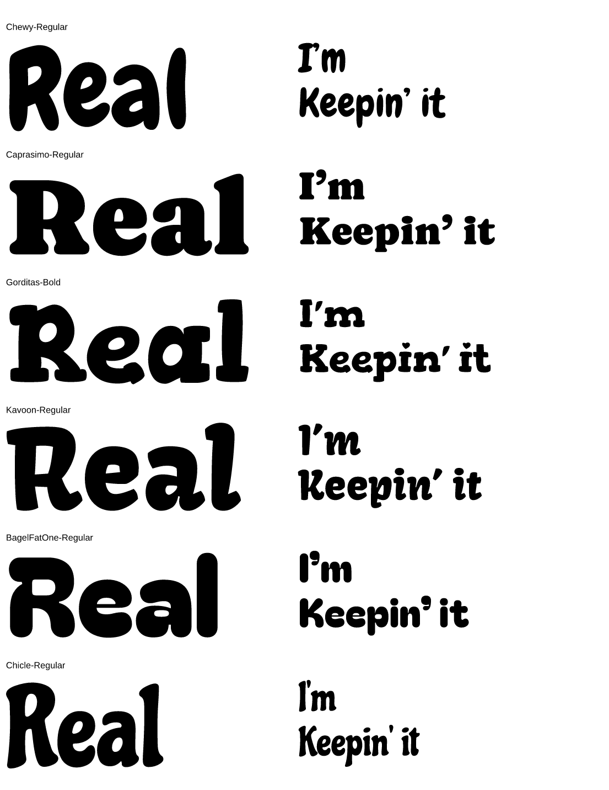

# Groovy 60s/70s display face for the Keepin' It Real shirt (issue #155)

**Result: Chewy (primary), Bagel Fat One (heavier alternative).** Neither
is a confirmed identification of the original font. The photo of the
shirt (front: `I'm` / `Keepin' it` / `Real`) does not name the face, and
a ten-year-old Zazzle/GIMP design could have used any free 60s/70s
"hippie" display font, so this is a **look-alike chosen by eye, flagged
for Jerome's review**.

## What the original looks like

Soft, rounded, hand-cut 1960s/70s letters: `R` with a round bowl and a
leg that flares outward, `e` with a slanted crossbar, single-storey-feel
`a`, and an `l` whose top is cut at a slant. Heavy, but with visible
counters. Thin dark outline. (Mixed case: `Real`, not `REAL`.)

## Reference vs finalists

| Original shirt (cropped photo) | Finalists: Gorditas, Bagel Fat One, Chewy, Kavoon |
|---|---|
|  |  |
| |  |

## Serifs and feet

Looking closely at the crop, the original's `I` and `K` carry small soft
bracketed serifs and the `R`/`l` have flared feet: a Cooper-Black-family
trait, not a plain rounded sans. `groovy-serif-strip.png` sets Chewy,
Caprasimo, Gorditas Bold, Kavoon, Bagel Fat One and Chicle at one size.
Chewy's `I` has slab-like ends and the `R`/`K` legs flare; Kavoon is the
same idea but more calligraphic. Caprasimo is the most literal Cooper
clone (true serifs) but is crisp and regular where the shirt is loose and
hand-cut, and its `l` is upright; Gorditas' serifs are hard slab blocks.
**Trade-off:** Chewy matches the looseness, flared legs and slanted `l`
but its serifs are vestigial; if the human reviewer wants a truer
Cooper feel, Caprasimo is the alternative (not installed; it is OFL and a
one-line addition).

## Candidates (20 rendered)

`fonts/groovy-candidates.png`: `Real` and `I'm Keepin' it Real` in Caprasimo,
Bagel Fat One, Chango, Modak, Rammetto One, Titan One, Gorditas, Shrikhand,
Sniglet, Lilita One, Bevan, Boogaloo, Galindo, Kavoon, Mochiy Pop One,
Chewy, Chicle, Coiny, Bowlby One, Fascinate.

`fonts/groovy-finalists.png`: Gorditas Bold, Bagel Fat One, Chewy, Kavoon large.

Rejected: Bevan, Titan One, Chango and Rammetto One read as
sturdy sign-painter faces without the loose hand-cut feel (Caprasimo: see
above); Modak and
Mochiy Pop One are too inflated (counters vanish); Shrikhand is
italic; Gorditas has hard slab serifs on the `R`; Boogaloo, Galindo, Chicle
and Coiny are too condensed or thin.

## Choice

- **Chewy** matches the letterform quirks best: flared-leg `R`,
  slanted-crossbar `e`, slanted-top `l`, soft hand-cut edges. It is a bit
  lighter than the shirt's letters, which the outline-plus-mottled-fill
  treatment (`lib/lettering.ps`) makes up for.
- **Bagel Fat One** matches the *weight and blobbiness* best (tiny
  counters, Cooper Black spirit) but its `l` is a plain rounded bar.
  Kept as the heavier alternative.

## Licences

- Chewy: Apache 2.0 (Google Fonts, `LICENSE.txt` alongside the font).
- Bagel Fat One: SIL OFL 1.1 (`OFL.txt` alongside the font).

Both allow embedding in documents and redistribution with the licence
text, as with the other catalog faces.

## Compatibility check

`fonts/groovy-specimen.png` (`examples/groovy_faces.ps`) runs the shirt-front
`hllayout` composition in each face: counters, apostrophes and the
`I'm`/`Keepin' it` tuck against `ea` all resolve, ink boxes agree with the
glyphs. `tests/groovy_faces.rs` asserts both are outline faces resolved
by stem and work through `psyletter` and `hllayout`. Images live in
`docs/fonts/`.
